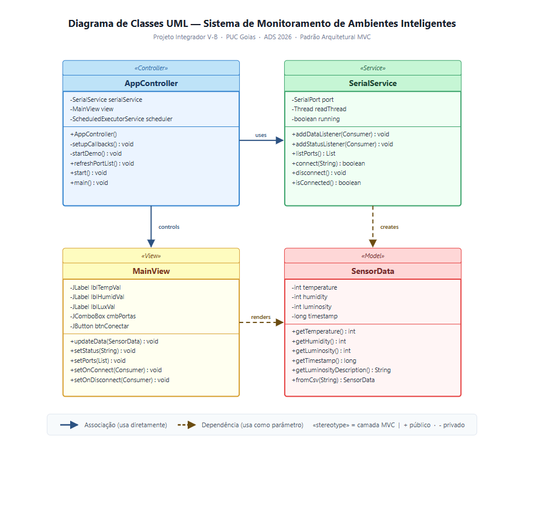

# RELATÓRIO TÉCNICO — PROJETO INTEGRADOR V-B

**SISTEMA DE MONITORAMENTO DE AMBIENTES INTELIGENTES**

---

PUC GOIÁS — PONTIFÍCIA UNIVERSIDADE CATÓLICA DE GOIÁS  
COORDENAÇÃO DE EDUCAÇÃO A DISTÂNCIA — CEAD  
ESCOLA POLITÉCNICA E DE ARTES  
CURSO DE ANÁLISE E DESENVOLVIMENTO DE SISTEMAS

**Disciplina:** Projeto Integrador V – B  
**Professor:** Thalles Bruno G. N. dos Santos  
**Aluno(a):** Werley Lemes Da Silva Filho  
**Matrícula:** 1132024200180  
**Data de entrega:** 07 de abril de 2026  
**Vídeo de apresentação:** 🎬 https://www.youtube.com/watch?v=JY8bV3CvmRY

---

## 1. INTRODUÇÃO

### 1.1 Motivação e Proposta

Marcos é um estudante de Análise e Desenvolvimento de Sistemas que se mudou para uma casa antiga herdada de seu avô. Interessado em tecnologia e inovação, ele decidiu transformar sua nova residência em um "ambiente inteligente". Para iniciar, Marcos deseja monitorar temperatura, umidade e luminosidade em alguns cômodos, a fim de otimizar o uso de energia e garantir seu conforto.

Para atingir esse objetivo, Marcos identificou a necessidade de desenvolver um sistema de baixo custo utilizando componentes acessíveis e linguagens de programação amplamente utilizadas. Optou por um protótipo inicial utilizando a plataforma Arduino para coleta de dados e Java para a aplicação que processa e exibe as informações de forma intuitiva.

### 1.2 Justificativa

O monitoramento de ambientes inteligentes é cada vez mais relevante para economia de energia, conforto e segurança. A combinação de Arduino — pelo seu baixo custo e facilidade de uso — com Java — pela sua robustez e portabilidade — torna este projeto um excelente caso de estudo para prototipagem de sistemas IoT acadêmicos.

---

## 2. OBJETIVOS

### 2.1 Objetivo Geral

Desenvolver um sistema protótipo de monitoramento de ambientes inteligentes utilizando a plataforma Arduino e a linguagem Java.

### 2.2 Objetivos Específicos

- Desenvolver um circuito protótipo utilizando Arduino UNO com sensores DHT11 (temperatura e umidade) e LDR (luminosidade), simulado no Tinkercad;
- Desenvolver um módulo Java para leitura e exibição dos dados coletados pelo Arduino em tempo real;
- Criar um Diagrama de Classes UML descrevendo os componentes de software do sistema;
- Desenvolver um protótipo visual de interface (UI).

---

## 3. TECNOLOGIAS E FERRAMENTAS UTILIZADAS

### 3.1 Camada Arduino

| Componente | Descrição |
|-----------|-----------|
| Arduino UNO R3 | Plataforma de prototipagem de hardware aberto |
| Sensor DHT11 | Sensor digital de temperatura (°C) e umidade relativa do ar (%) |
| LDR (fotoresistor) | Sensor analógico de luminosidade (0–1023) com divisor de tensão (resistor 10kΩ) |
| Tinkercad | Plataforma online de simulação de circuitos Arduino |

**Pinagem do circuito:**
- DHT11: Pino Digital 2 (Data), 5V (VCC), GND
- LDR: Pino Analógico A0, com divisor de tensão (resistor 10kΩ entre A0 e GND)

**Protocolo de comunicação serial:**
- Baud rate: 9600 bps
- Formato: `temperatura,umidade,luminosidade\n` (CSV com newline)
- Exemplo de saída: `25,60,512`
- Frequência: uma leitura a cada 2 segundos

### 3.2 Camada Java

| Componente | Versão | Função |
|-----------|--------|--------|
| Java SE | 17+ | Linguagem de programação principal |
| jSerialComm | 2.11.0 | Comunicação serial (substituto moderno do RXTX) |
| FlatLaf Dark | 3.4 | Look & Feel moderno para Swing |
| Apache Maven | 3.9.6 | Gerenciador de dependências e build |

**Padrão arquitetural:** MVC (Model-View-Controller)

---

## 4. METODOLOGIA

### 4.1 Arquitetura do Sistema

O sistema é composto por duas camadas principais:

**Camada de aquisição (Arduino/Tinkercad):** O Arduino UNO lê os sensores DHT11 e LDR e transmite os dados via porta serial no formato CSV. No ambiente simulado (Tinkercad), os sliders interativos permitem ajustar temperatura, umidade e luminosidade durante a demonstração.

**Camada de processamento e exibição (Java):** O módulo Java recebe os dados seriais, realiza o parsing do CSV e exibe os valores em tempo real em uma interface gráfica Swing com tema escuro moderno (FlatLaf).

### 4.2 Diagrama de Classes UML

O sistema Java segue o padrão MVC com as seguintes classes principais:

- **`SensorData`** (Model): POJO que representa uma leitura dos sensores, contendo temperatura (int), umidade (int), luminosidade (int) e timestamp (long). Possui o método estático `fromCsv()` para parsear linhas CSV do Arduino.

- **`SerialService`** (Service): Gerencia a conexão serial usando a biblioteca jSerialComm. Executa a leitura em background thread (daemon) e notifica a View via padrão Observer (`Consumer<SensorData>`), garantindo que atualizações de UI ocorram via `SwingUtilities.invokeLater()`.

- **`MainView`** (View): Interface Swing com FlatLaf Dark que exibe os três valores dos sensores em cards visuais, além de controles para seleção de porta COM e reconexão sem reiniciar a aplicação.

- **`AppController`** (Controller): Ponto de entrada da aplicação (método `main()`). Instancia SerialService e MainView, configura os callbacks entre eles e gerencia o ciclo de vida da aplicação.

### 4.3 Protótipo da Interface

A interface abaixo representa a visão futura do sistema para dispositivos móveis, desenvolvida no Figma com tema escuro, cards por sensor e navegação inferior:

O protótipo de interface foi desenvolvido no **Figma** e está disponível em:  
🔗 https://www.figma.com/design/7UXbsHgpB3rGO44tyBmvIZ/Project-Integrator-V-B-PUC-GO?node-id=1-23&t=Vub1YL1a24Vj0Hoa-1

---

## 5. RESULTADOS

### 5.1 Circuito Arduino (Tinkercad)

O circuito foi implementado e simulado com sucesso no Tinkercad. A simulação demonstra o funcionamento dos sensores DHT11 e LDR, com os sliders interativos permitindo variação dos valores durante a execução.

**Link da simulação no Tinkercad:**  
🔗 https://www.tinkercad.com/things/eALbQIdph4d-pi-v-b-monitoramento-ambiental

> **Nota:** O Tinkercad não suporta o sensor DHT11 nativamente. Foram utilizados TMP36 (temperatura), LDR (luminosidade) e Potenciômetro (simulando umidade), mantendo o mesmo protocolo CSV de saída serial.

### 5.2 Módulo Java

O módulo Java foi implementado e compilado com sucesso utilizando Maven. A aplicação exibe em tempo real:
- Temperatura em graus Celsius
- Umidade relativa em percentual
- Luminosidade em valor analógico (0–1023) com descrição textual

**Repositório GitHub:**  
🔗 https://github.com/novak-drg/project-integrator-v-b-puc

A interface gráfica exibe os dados em tempo real com tema escuro (FlatLaf), três cards de sensores com cores distintas (laranja para temperatura, azul para umidade, dourado para luminosidade), status do ambiente e indicador de conexão.

### 5.3 Diagrama UML

O Diagrama de Classes UML documenta as 4 classes principais do sistema, seus atributos, métodos e relacionamentos, conforme o padrão MVC adotado.

**Diagrama gerado com yED Live** — arquivo: `uml/diagrama-classes.png`

---

## 5.4 Vídeo de Apresentação

O vídeo de apresentação demonstra o funcionamento completo do sistema: circuito no Tinkercad, módulo Java em execução com modo DEMO e protótipo de interface mobile no Figma.

**🎬 Link do vídeo:** https://www.youtube.com/watch?v=JY8bV3CvmRY

---

## 6. CONCLUSÃO

O sistema de monitoramento de ambientes inteligentes foi desenvolvido com sucesso dentro do escopo proposto. A integração entre Arduino (simulado no Tinkercad) e Java demostrou ser viável e educacionalmente rica, consolidando conceitos de:

- Programação orientada a objetos (POO) com Java
- Padrão arquitetural MVC
- Comunicação serial entre hardware e software
- Desenvolvimento de interfaces gráficas com Swing
- Prototipagem de circuitos eletrônicos

O projeto atende todos os entregáveis definidos no enunciado e serve como base para futuras extensões, como integração com hardware real, histórico de leituras com gráficos e múltiplos ambientes monitorados.

---

## 7. REFERENCIAL TEÓRICO

BANZI, Massimo; SHILOH, Michael. **Getting Started with Arduino**. 3. ed. Sebastopol: O'Reilly Media, 2015.

BLOCH, Joshua. **Effective Java**. 3. ed. Boston: Addison-Wesley, 2018.

MARGOLIS, Michael. **Arduino Cookbook**. 2. ed. Sebastopol: O'Reilly Media, 2012.

FAZECAST. **jSerialComm: Platform-independent serial port access for Java**. Disponível em: https://github.com/Fazecast/jSerialComm. Acesso em: 28 mar. 2026.

ORACLE. **The Java Tutorials: Creating a GUI With Swing**. Disponível em: https://docs.oracle.com/javase/tutorial/uiswing/. Acesso em: 28 mar. 2026.

ARDUINO. **DHT11 — Temperature Sensor Documentation**. Disponível em: https://www.arduino.cc/reference/en/libraries/dht11/. Acesso em: 28 mar. 2026.

---

*Formatação: Arial 12pt, espaço simples, margens: 2,5cm (superior/inferior), 3cm (laterais)*
