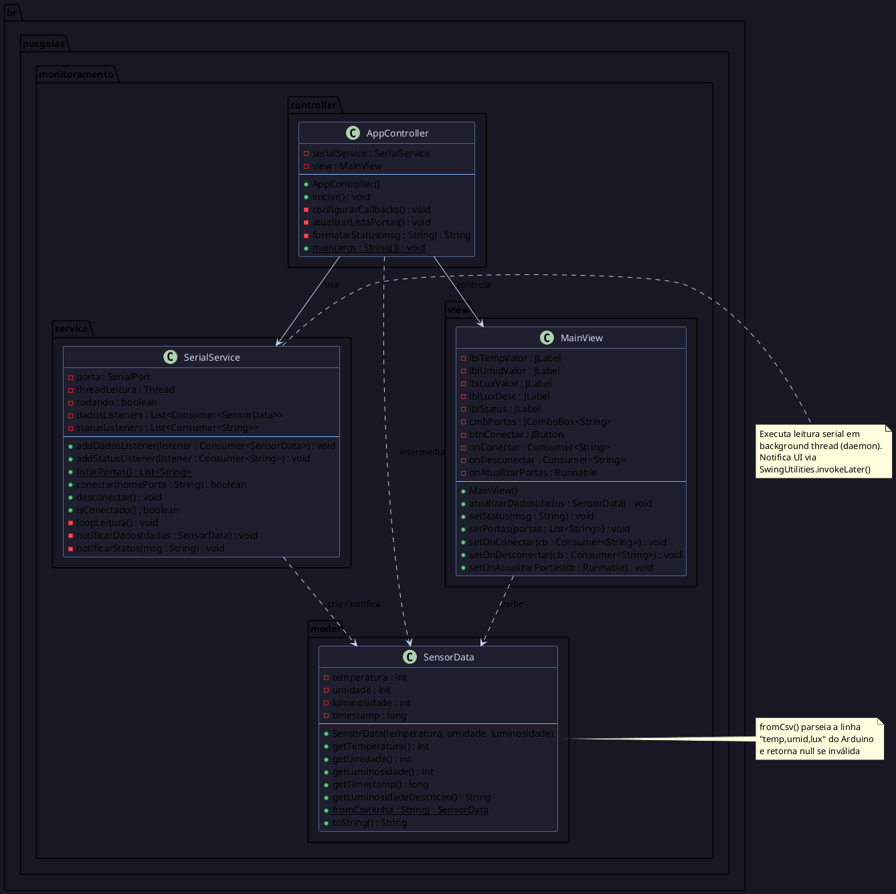

# Diagrama de Classes UML — Sistema de Monitoramento de Ambientes

> Projeto Integrador V-B — PUC Goiás — ADS 2026

## Diagrama (PlantUML / Texto)

## Como gerar a imagem do diagrama

### Opção 1 — LucidChart (recomendado pelo professor)
1. Acesse https://www.lucidchart.com
2. Novo diagrama → **UML Class Diagram**
3. Adicione as 4 classes manualmente com base no diagrama acima
4. Exporte como PNG/SVG e salve em `uml/diagrama-classes.png`

### Opção 2 — yED Live
1. Acesse https://www.yworks.com/yed-live
2. Crie o diagrama de classes manualmente
3. Exporte e salve em `uml/diagrama-classes.png`

### Opção 3 — PlantUML online
1. Acesse https://www.plantuml.com/plantuml/uml/
2. Cole o código PlantUML acima (entre `@startuml` e `@enduml`)
3. Baixe a imagem gerada e salve em `uml/diagrama-classes.png`

## Descrição dos Relacionamentos

| Relação | Tipo | Descrição |
|---------|------|-----------|
| AppController → SerialService | Associação | Controller instancia e usa o SerialService |
| AppController → MainView | Associação | Controller instancia e configura a View |
| SerialService ⇢ SensorData | Dependência | Cria objetos SensorData ao parsear CSV |
| MainView ⇢ SensorData | Dependência | Recebe e exibe dados do SensorData |

## Checklist de entrega UML

- [ ] Diagrama gerado no LucidChart ou yED
- [ ] 4 classes presentes: `SensorData`, `SerialService`, `MainView`, `AppController`
- [ ] Atributos e métodos listados em cada classe
- [ ] Relacionamentos/associações representados com setas
- [ ] Imagem exportada como PNG salva em `uml/diagrama-classes.png`
- [ ] Link do diagrama online salvo em `uml/LINK.md`
